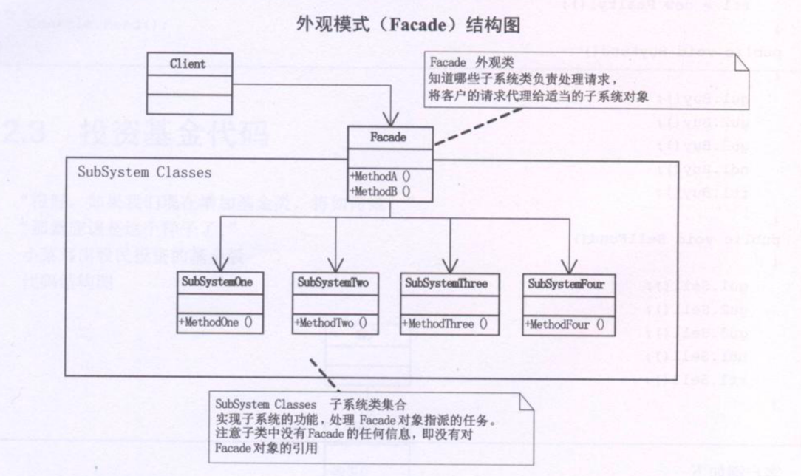
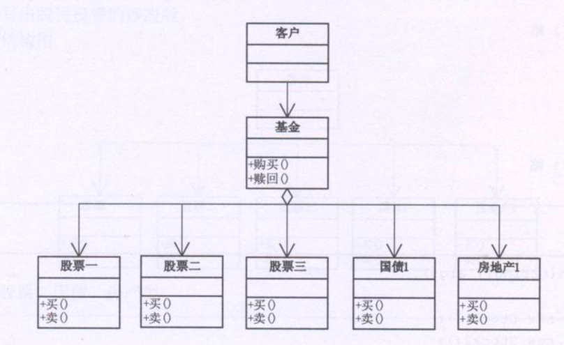

# 外观模式

为子系统中的一组接口提供一个一致的界面，此模式定义了一个高层接口，这个接口使得这一子系统更加容易使用

## 结构图

## 示例

- 购买股票，需要很多知识来支撑
- 我们可以考虑基金的形式来管理我们的股票
- 基金类，他需要了解所有的股票或其他投资方式的方法或属性，进行组合，以备外界调用
- 此时用户不需要了解股票，甚至可以对股票一无所知，买了基金就会叫睡觉，一段时间后再赎回就可以大把数钱。参与股票的具体买卖都由基金公司完成

