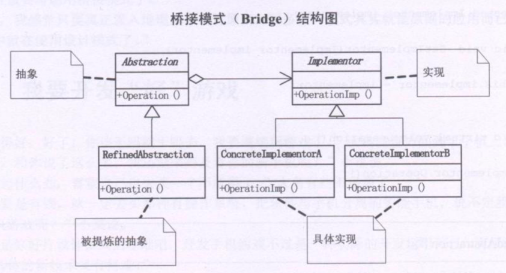
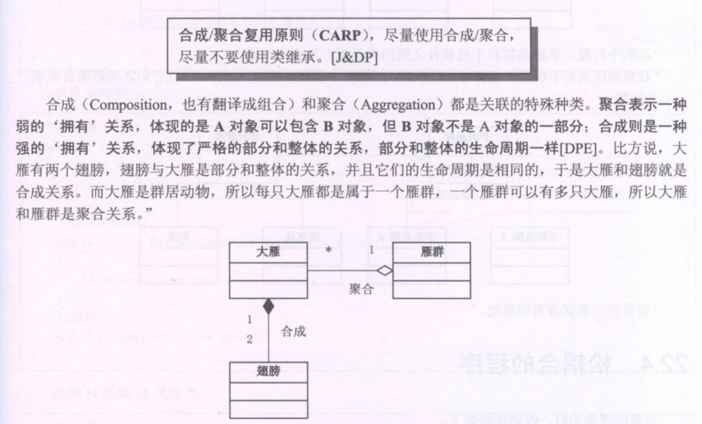
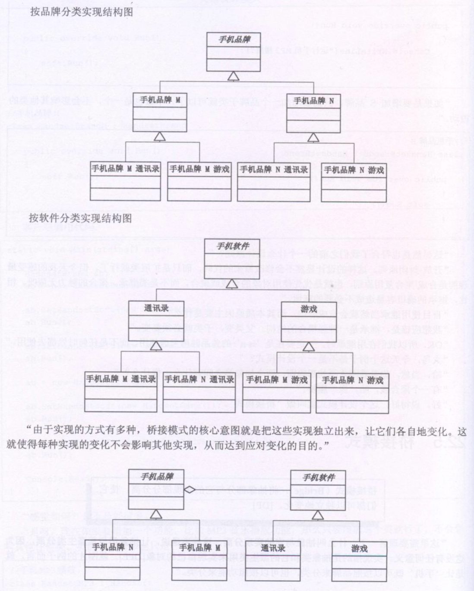

# 桥接模式

将抽象部分与它的实现部分分离，使它们都可以独立地变化

实现系统可能有多角度分类，每一种分类都有可能变化，那么就把这种多角度分离出来让它们独立变化，减少它们之间的耦合

## 先上结构图

## 合成/聚合复用原则

尽量使用合成/聚合，尽量不要使用类继承

## 示例

- 手机既可以按照品牌来分类，也可以按照功能来分类
- 将手机品牌与手机软件分离开来独立维护，再进行一个关联注入即可
- 符合了 开放-封闭原则

